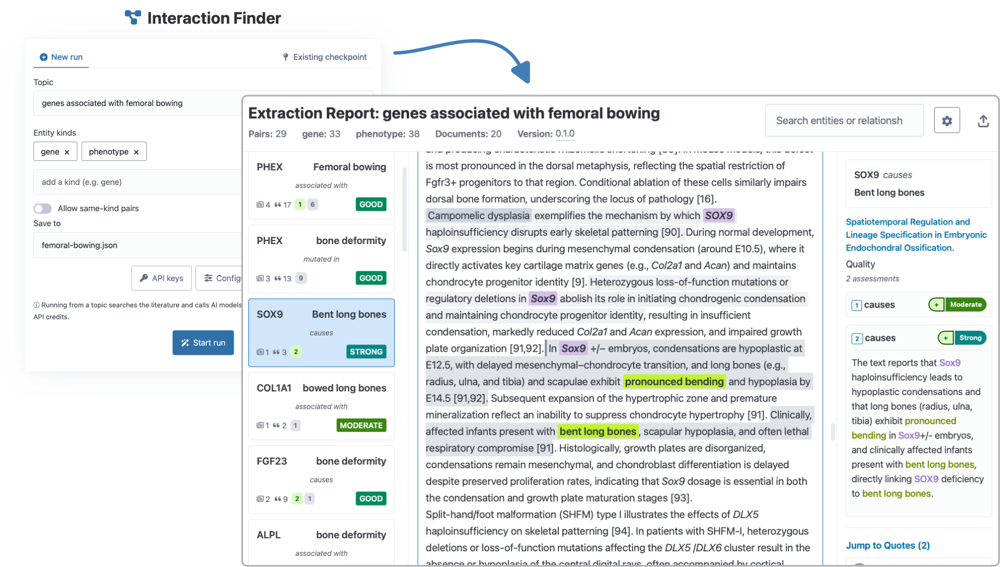

# interaction-finder

Automated discovery of biological associations from scientific literature using AI-driven pipelines.



## Installation

Requires Python 3.13+. Run directly with [uv](https://docs.astral.sh/uv/):

```bash
uvx --from "git+https://github.com/tecosaur/interaction_finder.git" interaction-finder --help
```

Or clone and install locally:

```bash
git clone git@github.com:tecosaur/interaction_finder.git
cd interaction-finder
uv sync
```

Set your OpenAI API key (or other LLM provider):

```bash
export OPENAI_API_KEY=your-key
```

`uv sync` handles all Python dependencies from the lockfile; nothing else needs
installing. Worth knowing what is being pulled in, since two of them are large:
`crawl4ai` (article fetching) installs a headless browser, and `chonkie`,
`keybert`, and `sentence-transformers` download embedding models on first use,
so the first run is slower than later ones and needs a few GB of disk. An
`OPENAI_API_KEY` is the only required credential for the default
configuration; PubMed search works without a key, though setting
`NCBI_API_KEY` raises the rate limit and makes searches noticeably faster.

## The browser UI

The quickest way in is the browser UI. Launch it locally and it opens in your default browser:

```bash
uv run interaction-finder ui
```

Start a run from a topic and set of entity kinds, watch progress (and any warnings, such as a PubMed rate limit) stream in live, then read the result as an extraction report: each entity pair carries a trust badge, the source text with mentions and evidence quotes highlighted, and the reasoning behind every quality assessment. You can also open an existing checkpoint, edit the config, and set API keys without leaving the page.

## Command-line usage

The pipeline has three stages: **keywords** (find bridging terms from reviews), **search** (query literature databases), and **extract** (identify entity pairs with evidence). Running a later stage automatically executes preceding ones.

Extract gene-disease associations for a research topic:

```bash
uv run interaction-finder extract "Inhibitors of IL-23" \
  -e antibody -e target -o results.json
```

The `-e` flag specifies entity types to extract (e.g., `gene`, `disease`, `phenotype`, `drug`). Pairs are formed between the specified types.

Generate an HTML report:

```bash
uv run interaction-finder report results.json
```

## Quick Test Run

For a faster test with minimal API calls, limit search rounds and results:

```bash
uv run interaction-finder extract "Inhibitors of IL-23" \
  -e antibody -e target -o results.json \
  -O stage.search.max_rounds=1 \
  -O stage.search.results_per_query=2
```

## What a run costs

Figures below are from the 60-topic evaluation in the accompanying paper, all
on the default configuration with `gpt-5-mini`. Cost scales with the size of
the literature, so the domain matters more than any setting: a topic with a
narrow literature (one ligand's receptors) is several times cheaper than a
broadly-studied phenotype.

| Domain (20 topics each)  | Cost/topic | Articles/topic | Judged pairs/topic | LLM requests/topic |
|--------------------------|-----------:|---------------:|-------------------:|-------------------:|
| Ligand–receptor          |      $1.90 |             96 |                 38 |                647 |
| Cell type–marker         |      $4.60 |            120 |                308 |              1,416 |
| Disease–gene             |      $6.10 |            256 |                382 |              2,166 |

Article, pair, and request figures are per-topic medians; per-topic variation
within a domain is wide (disease–gene ranges from 140 to 4,822 requests). The
full 60-topic evaluation cost $255. Scaling from these numbers: a small
project of five narrow topics runs about $10–25, and a medium project of
twenty broad topics about $100–150.

Two settings dominate cost if you need to reduce it — search breadth
(`stage.search.max_rounds`, `stage.search.results_per_query`) and the model
assigned to the extraction agents. Model choice is a real trade-off rather
than a free saving: on a common topic, quote-match failure rates were 13%, 2%,
and 1% for `gpt-5-nano`, `gpt-5-mini`, and `gpt-5`, while `gpt-5` cost roughly
85× `gpt-5-mini` for no gain in recovery. `gpt-5-mini` is the default for that
reason.

Wall-clock time is dominated by article fetching and by provider rate limits
rather than by local computation, so it varies with network conditions and
API tier; expect tens of minutes for a narrow topic and a few hours for a
broad one.

## Resuming from a checkpoint

Every stage writes its state into the output file, so a run can be resumed or
partially re-run without repeating earlier work. This matters because search
is the slow part and extraction is the part you are most likely to want to
redo (with a different model, or after changing a threshold).

```bash
# Full run, writing a checkpoint
uv run interaction-finder extract "receptors that bind to VEGFB" \
  -e receptor -e ligand -o vegfb.json

# Re-run extraction only, reusing the retrieved corpus, with a stronger model
uv run interaction-finder extract "receptors that bind to VEGFB" \
  -e receptor -e ligand -o vegfb.json \
  -O agents.extraction.pair_judge.llm=openai:gpt-5

# Regenerate the report from an existing checkpoint (no API calls)
uv run interaction-finder report vegfb.json
```

Running a stage re-executes preceding stages only where their state is absent,
so pointing `extract` at an existing checkpoint reuses its keywords and search
results. Report generation never calls an API, so iterating on presentation is
free. See the paper's supplementary material for what each stage records.

## Sharing a checkpoint or report

Checkpoints and reports embed the text of the articles they were built from.
Fetching that text for your own analysis is ordinary use of your own access, but
sending someone a checkpoint passes the text on, which most subscription and
many open-access licences do not permit. The `redact` command prepares a copy
you can share:

```bash
# What does this file contain, and what may be shared?
uv run interaction-finder redact results.json --check

# Write a shareable copy
uv run interaction-finder redact results.json -o results-shareable.json
```

Each article's licence is resolved through [OpenAlex](https://openalex.org)
(cached, so re-runs are free), and each article then falls into one of three
cases. Text under a licence that permits redistribution — CC-BY, CC-BY-SA, CC0,
public domain, or a non-commercial/no-derivatives variant — is kept, with the
licence recorded on the resource and shown among the source links in reports,
linking its licence deed.
Records holding only an abstract are kept as they are, whatever the article's
licence: abstracts are distributed openly by publishers and indexing services.
Everything else is reduced to a **quote skeleton**: the passages your results
actually quote, each extended to sentence bounds and placed under its section
heading, with omitted stretches marked by size —

```
## Results

> Depletion of ACME1 abolished the WIDGET2 signal entirely.
…412 words…
> Rescue experiments restored binding to wild-type levels.
```

This keeps a report readable and its quotes checkable while reproducing a small
share of any article (a few percent in practice), so it cannot substitute for
reading the original. Identifiers, DOIs, dates, hashes, and the original
character offsets are all retained, so anyone can re-fetch a source and confirm
the quotes against it. Regenerate the report from the redacted checkpoint
(`interaction-finder report`) and it will show the skeletons in place of the
withheld text, opening each such document with a note explaining why its text is
not shown and how long the original runs; a report built from an unredacted
checkpoint still contains everything the original did.

Useful flags: `--everything` redacts every article regardless of licence, when
you would rather share one thing on one clear basis; `--no-share-alike` keeps
only freely licensed text, redacting NC/ND/SA articles whose conditions would
otherwise bind you; `-v` lists the verdict per article. Set `OPENALEX_EMAIL` to identify yourself to OpenAlex and use its
faster polite pool; it is not required.
Note that "free to read" is not the same as "free to redistribute" — an article
unlocked at the publisher's discretion, with no open licence, is treated as
restricted.

The published evaluation checkpoints were prepared this way.

## A worked example

Starting from nothing, this reproduces one evaluation topic end to end:

```bash
export OPENAI_API_KEY=your-key
uv run interaction-finder extract "receptors that bind to VEGFB" \
  -e receptor -e ligand -o vegfb.json
uv run interaction-finder report vegfb.json   # writes vegfb.html
```

The report opens on the candidate list, ordered by a recency-weighted count of
supporting documents and restricted to associations judged specifically
relevant to the topic ("On-topic only", on by default; toggle it to see
everything). Each row expands to the supporting quotes, each highlighted in
its source passage, with the reasoning behind every assessment. This topic
cost $4.04 in the evaluation.

## Search Backends

- `pubmed` — NCBI PubMed (default, best for biomedical literature)
- `perplexica` — Local Perplexica instance (broader web search)
- `openai` — OpenAI web search API

```bash
uv run interaction-finder extract "topic" -e gene -b perplexica -o results.json
```

## Configuration

Create a `config.toml` to customize LLM models:

```toml
[agents._]
llm = "openai:gpt-4o-mini"

[agents.extraction.pair_judge]
llm = "openai:gpt-4o"
```

Override via CLI with `-O key=value`. See `uv run interaction-finder config schema` for all options.
